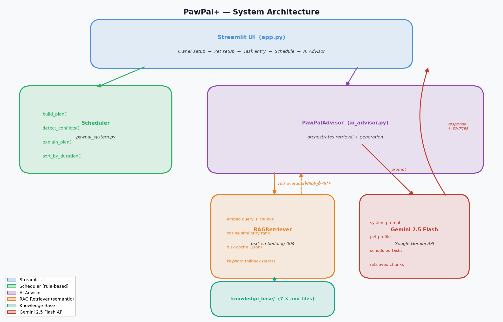
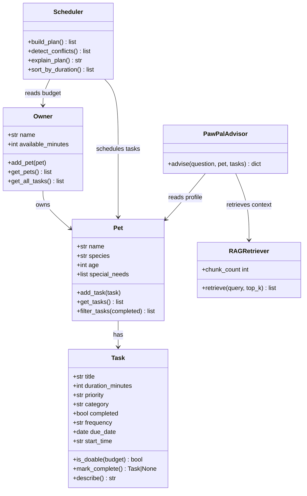
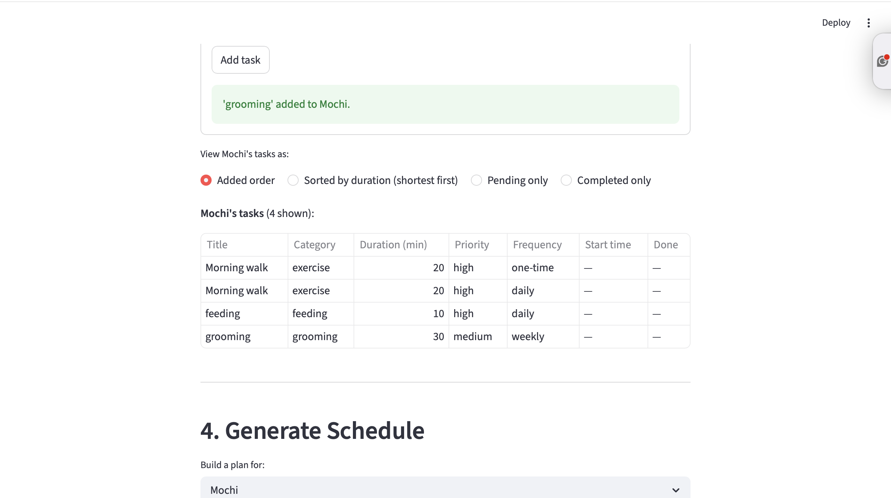
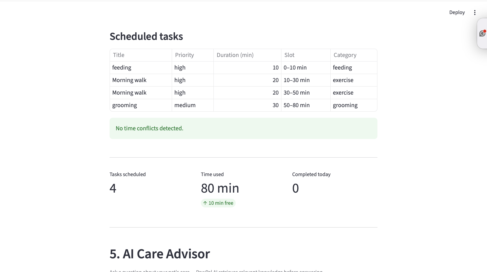
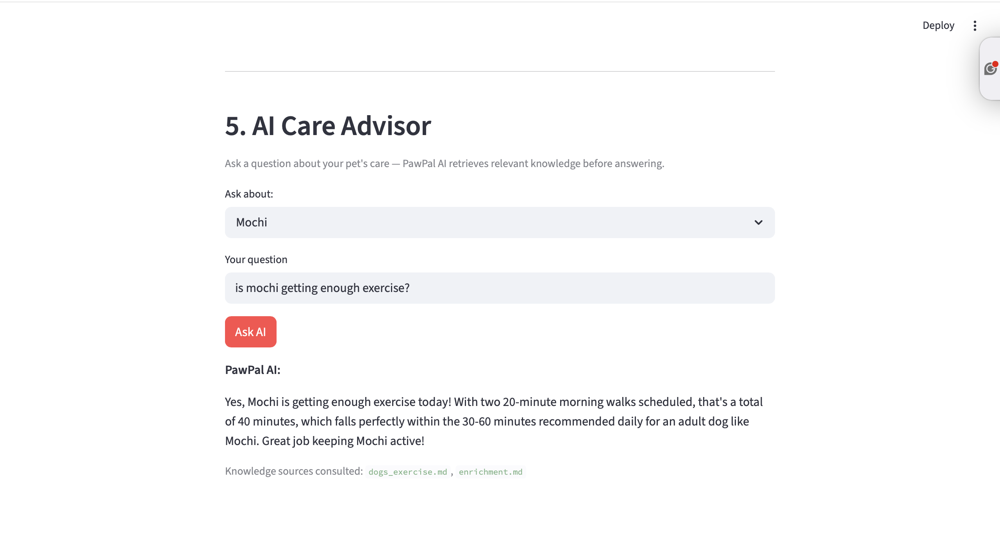

# PawPal+ — AI-Powered Pet Care Scheduler

> **Original project:** PawPal+ (Modules 1–3) was a Streamlit app for scheduling daily pet care tasks. It allowed owners to register pets, add care tasks with durations and priorities, and generate a time-budgeted daily plan ordered by priority. The scheduling, conflict detection, and recurring task logic were entirely rule-based with no AI component.
>
> This submission (Module 4) extends PawPal+ with a Retrieval-Augmented Generation (RAG) layer: a Gemini-powered AI advisor that retrieves relevant pet care knowledge before answering questions about a specific pet's schedule and needs.

---

## Summary

PawPal+ is a smart pet care planning assistant that combines rule-based scheduling with AI-powered advice. Given a pet's profile and daily tasks, the system builds a priority-ordered, time-budgeted schedule and lets owners ask natural-language questions — "Is Mochi getting enough exercise?" or "How often should I groom Luna?" — answered by an AI that first retrieves relevant facts from a curated knowledge base before calling Gemini.

---

## Architecture Overview



```
┌─────────────────────────────────────────────────────────────────┐
│                        Streamlit UI (app.py)                    │
│  Owner / Pet setup → Task entry → Schedule → AI Care Advisor    │
└────────────┬──────────────────────┬────────────────────────────┘
             │                      │
             ▼                      ▼
  ┌─────────────────┐    ┌──────────────────────────┐
  │ Scheduler        │    │ PawPalAdvisor             │
  │ (pawpal_system)  │    │ (ai_advisor.py)           │
  │                  │    │                           │
  │ build_plan()     │    │  1. RAGRetriever          │
  │ detect_conflicts │    │     └─ embeds query +     │
  │ explain_plan()   │    │        chunks; ranks by   │
  └─────────────────┘    │        cosine similarity  │
                          │                           │
                          │  2. Gemini API call       │
                          │     (gemini-2.5-flash)    │
                          │     with retrieved context│
                          │     + pet profile         │
                          │                           │
                          │  3. Logs to pawpal.log    │
                          └──────────────────────────┘
                                      │
                          ┌───────────▼──────────┐
                          │  knowledge_base/      │
                          │  dogs_exercise.md     │
                          │  cats_care.md         │
                          │  senior_pets.md       │
                          │  nutrition.md         │
                          │  grooming.md          │
                          │  medications.md       │
                          │  enrichment.md        │
                          └──────────────────────┘
```

**Data flow:**
1. Owner sets up their profile and pets in the Streamlit UI.
2. Tasks are added per pet; the Scheduler builds a priority-ordered daily plan.
3. In the AI Advisor section, the user types a question.
4. `RAGRetriever` embeds the query and all knowledge-base paragraphs using `text-embedding-004` and returns the top 3 most relevant chunks by cosine similarity.
5. `PawPalAdvisor` sends a Gemini API call (`gemini-2.5-flash`) combining: the pet's profile, today's scheduled tasks, and the retrieved chunks.
6. Gemini returns a grounded, contextual answer; the UI shows both the answer and the source files consulted.
7. Every interaction is logged to `pawpal.log`.

**UML class diagram:**



---

## Setup Instructions

### Prerequisites

- Python 3.9 or higher (tested on 3.12)
- A Google Gemini API key — get a free one at [aistudio.google.com](https://aistudio.google.com)

### Install

```bash
git clone <repo-url>
cd PawPal-applied-AI-system-project
pip install -r requirements.txt
```

### Configure API key

Create a `.env` file in the project root:

```
GEMINI_API_KEY=your-key-here
```

Or set it as an environment variable:

```bash
export GEMINI_API_KEY=your-key-here   # macOS / Linux
# or
set GEMINI_API_KEY=your-key-here      # Windows Command Prompt
```

### Run the app

```bash
streamlit run app.py
```

### Run tests

```bash
python -m pytest
```

Expected output: **33 passed** (22 scheduling tests + 11 RAG retriever tests).

---

## Sample Interactions

### Example 1 — Exercise check for a young dog

**Pet:** Mochi, dog, 3 years old  
**Scheduled tasks:** Morning walk (30 min, high), Trick training (20 min, low)  
**Question:** "Is Mochi getting enough exercise?"

**PawPal AI response:**
> Based on the guidelines for adult dogs, Mochi is doing well but could benefit from a bit more activity. Adult dogs (1–7 years) generally need at least 30–60 minutes of daily exercise. Mochi's morning walk covers 30 minutes, which meets the minimum, but adding the trick training brings total activity to 50 minutes — right in the ideal range for a medium-energy adult dog. If Mochi is a larger or high-energy breed, consider extending one walk or adding an evening session.

**Sources consulted:** `dogs_exercise.md`, `enrichment.md`

---

### Example 2 — Grooming frequency for a cat

**Pet:** Luna, cat, 5 years old  
**Scheduled tasks:** Brush coat (10 min, medium)  
**Question:** "How often should I brush Luna?"

**PawPal AI response:**
> For a short-haired adult cat like Luna, brushing once or twice per week is typically sufficient to reduce shedding and prevent hairballs. The once-weekly brush in Luna's schedule meets the minimum recommendation. If Luna has a longer or denser coat, daily brushing would be more appropriate. Since you haven't noted a specific breed, once or twice weekly is a great baseline to keep her coat healthy.

**Sources consulted:** `grooming.md`, `cats_care.md`

---

### Example 3 — Care advice for a senior pet

**Pet:** Max, dog, 9 years old, special needs: arthritis  
**Scheduled tasks:** Morning walk (30 min, high)  
**Question:** "What should I keep in mind for Max given his age and arthritis?"

**PawPal AI response:**
> At 9 years, Max is solidly in senior territory for most breeds. A few things to consider: his 30-minute morning walk is fine but watch for signs of fatigue — limping during the walk, stiffness afterward, or reluctance to start. If you see those signs, splitting it into two shorter walks of 15 minutes each is gentler on arthritic joints. Low-impact exercise (leisurely walking, gentle swimming) is ideal. Also, twice-yearly vet check-ups are recommended for senior dogs to monitor joint health and catch any age-related conditions early. Orthopedic bedding can also help with comfort.

**Sources consulted:** `senior_pets.md`, `dogs_exercise.md`

---

## Design Decisions

**Why RAG over a plain LLM call?**  
A plain Gemini call with just the pet's profile would produce plausible-sounding but generic advice — it would have no way to distinguish between what the knowledge base specifically says and what it's extrapolating. RAG forces the system to retrieve concrete, fact-checked content before generating a response. The UI displays the source files consulted, so users can verify the AI is drawing on real content rather than hallucinating.

**Why semantic embeddings for retrieval?**  
The retriever uses Google's `text-embedding-004` model to embed both knowledge-base chunks and the user's query, then ranks by cosine similarity. This means synonym-heavy or paraphrased queries (e.g. "Is Mochi getting enough activity?" vs. "exercise") match correctly even when exact vocabulary differs. Embeddings are computed once and cached to disk (`knowledge_base/.embeddings_cache.json`), so subsequent runs incur no extra API calls. When no API key is present (e.g. in tests), the retriever automatically falls back to keyword overlap so all 11 retriever tests run without any network access.

**Why paragraph-level chunking?**  
Each paragraph in the knowledge files is a complete thought (e.g., "Adult dogs need X minutes of exercise"). Splitting at the sentence level would fragment context; splitting at the document level would make retrieval coarse. Paragraphs give the AI enough context to reason while keeping retrieved chunks specific.

**Why keep the scheduler and the AI advisor separate?**  
The scheduler is deterministic and testable — given the same inputs, it always produces the same plan. The AI advisor is probabilistic. Mixing them would make the scheduling logic untestable. The separation means 22 scheduler tests can run without any API key, while the AI tests (11 tests) are also API-key-free because they only test the retriever.

---

## Testing Summary

| Test file | Tests | Coverage area |
|---|---|---|
| `tests/test_pawpal.py` | 22 | Task, Pet, Owner, Scheduler logic |
| `tests/test_ai_advisor.py` | 11 | RAGRetriever loading, relevance, edge cases |
| **Total** | **33** | **All 33 pass** |

**Key results:**
- All species-specific queries retrieved the correct source files (dogs_exercise, cats_care, senior_pets, etc.).
- `test_dog_query_differs_from_cat_query` passes, proving that RAG retrieval produces different context for different species — the core requirement for meaningful RAG integration.
- Empty query and missing-directory edge cases are handled without exceptions.
- Scheduler tests confirm that priority ordering, time budget enforcement, and conflict detection all remain correct after the AI integration.

**What worked:** Semantic embeddings (`text-embedding-004`) combined with paragraph-level chunking produced reliable, synonym-aware retrieval. The disk cache means embeddings are only computed once, keeping the app fast on subsequent runs.

**What didn't work initially:** The original keyword overlap retriever failed on queries like "Is Mochi getting enough exercise?" because the adult-dog paragraph didn't contain the word "exercise." This was fixed first by rewording the knowledge base, then permanently by upgrading to semantic embeddings.

---

## Reflection

Building PawPal+ taught me that the hardest part of an AI system is not the model call — it's the data pipeline upstream of the model. Getting the retriever to return the *right* content for a given question required careful decisions about chunking, scoring, and vocabulary alignment between the knowledge base and likely user queries. A model call on bad context produces a confident-sounding wrong answer, which is worse than no answer.

The project also showed that separation of concerns matters as much in AI systems as in traditional software. Keeping the deterministic scheduler separate from the probabilistic AI advisor meant I could write 33 fully reproducible tests, none of which require an API key or internet access. That reliability is what makes the system trustworthy in practice.

---

## Demo Walkthrough

> 📹 Loom video link: _[Add Loom link here]_

### Screenshot Walkthrough

**1. Pet setup + task entry**



**2. Generated schedule with conflict detection**



**3. AI Care Advisor — example response**



---

## Portfolio Artifact

**GitHub Repository:**  
https://github.com/tanishav1815/PawPal-applied-AI-system-project

**Reflection — What This Project Says About Me as an AI Engineer:**

Building PawPal+ revealed that I care deeply about *grounded* AI — systems that can explain their reasoning and trace it back to verifiable sources. Rather than chasing the flashiest model output, I chose to implement RAG with semantic embeddings, paragraph-level chunking, and source attribution. This reflects a belief that AI systems are most valuable when they're transparent, testable, and composable with traditional software.

The project also demonstrates my commitment to engineering discipline. I separated the deterministic scheduler from the probabilistic AI advisor not for elegance, but because it enabled 33 fully reproducible tests without requiring an API key. That decision reflects a conviction that reliability and debuggability are non-negotiable in production AI — flashy demos don't matter if you can't verify the system works.

I also learned to be critical of AI-generated suggestions. When Claude suggested a flat task list on the `Owner` class, I rejected it because it violated encapsulation. This taught me that using AI effectively isn't about adopting every suggestion; it's about knowing when to say "that solves the problem but creates a worse one." That judgment separates engineers who ship systems they understand from engineers who assemble black boxes.

Most importantly, this project showed me that the bottleneck in AI systems isn't the model — it's the data pipeline. Spending time on knowledge base curation, chunking strategy, and embedding-based retrieval paid off far more than tweaking the Gemini prompt. That insight will shape how I approach AI engineering going forward: optimize for data quality and pipeline clarity first, model sophistication second.

---

## Repository Structure

```
PawPal-applied-AI-system-project/
├── app.py                  # Streamlit UI (5 sections including AI Advisor)
├── pawpal_system.py        # Core scheduling logic (Task, Pet, Owner, Scheduler)
├── ai_advisor.py           # RAGRetriever + PawPalAdvisor
├── main.py                 # CLI demo of backend logic
├── requirements.txt
├── model_card.md           # Reflection, limitations, AI collaboration notes
├── knowledge_base/
│   ├── dogs_exercise.md
│   ├── cats_care.md
│   ├── senior_pets.md
│   ├── nutrition.md
│   ├── grooming.md
│   ├── medications.md
│   └── enrichment.md
├── tests/
│   ├── test_pawpal.py      # 22 scheduling tests
│   └── test_ai_advisor.py  # 11 RAG retriever tests
└── assets/                 # Screenshots and diagrams
```
